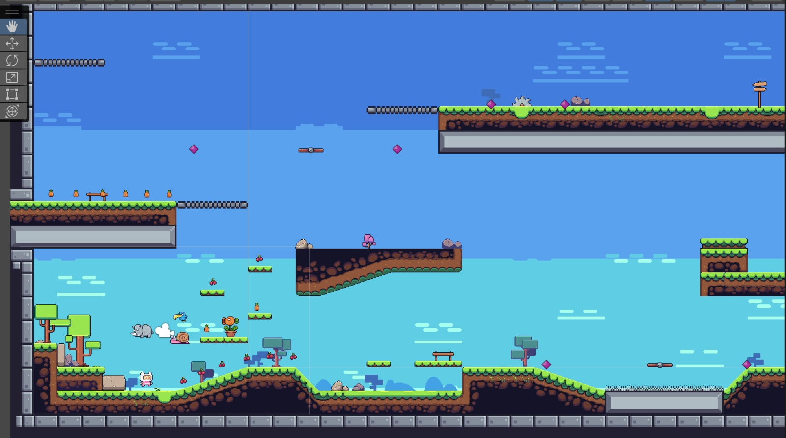

# **Takım İsmi**

Takım Unity 162

# Ürün İle İlgili Bilgiler

## Takım Elemanları
- Fatma Melisa Keklik: Scrum Master 
- Esma Nur Kıyak: Product Owner
- Derya Güner: Developer
- Alihan Güdenoğlu: Developer
- İdris Dindar: Developer
## Ürün İsmi

Portal Adventures

## Product Backlog URL

(https://trello.com/w/u1621)

## Ürün Açıklaması

 Ana karakterimiz  bir gün şans eseri ninesinin yemek tarifi kitabını bulur. Ninesinin yaptığı yemekleri çok seven karakterimiz bu yemekleri yapmaya karar verir. Ancak tarifler için gereken malzemeleri elde edebilmek için farklı portallarda yolculuk yaparak peşisıra maceralar yaşaması gerekmektedir zira bu malzemeleri temin etmesi umduğu kadar kolay olmayacaktır. Her seferinde farklı bir portalda farklı bir hikayeyle beklenmedik olaylar yaşayan karakterimiz zorlu bulmacalar ve gizemleri çözerek, görevleri tamamlayarak oyuncuya sıradışı bir oyun deneyimi sunar. 

## Ürün Özellikleri

- Derinlemesine Hikaye Modu
- Eşsiz Oyun Mekanikleri
- Retro Tarzı Grafikler
- Hızlı ve akıcı oynayış

## Hedef Kitle

- 13 yaş ve üstü oyuncular
- Retro oyun temasını sevenler
- Hikaye odaklı oyunları sevenler
- Epik fantastik oyunları sevenler

# Sprint 1

- **Sprint içinde tamamlanması tahmin edilen puan**:

 - 30 puan

- **Puan tamamlama mantığı**:
  
- Puan tamamlama mantığı, toplamda proje boyunca tamamlanması gereken 100 puanlık backlog bulunmaktadır. 4 sprint'e bölündüğünde ilk sprint'in en azından 30 puan ile başlaması gerektiğine karar verildi.

- **Daily Scrum**:

- Daily Scrum toplantılarının Discord üzerinden yapılmasına karar verilmiştir. Toplantı saati her gün takımda konuşularak kararlaştırılmaktadır. Takımdaki kişilerin bazıları çalıştığından uygun saat her gün aynı olamamaktadır.  Daily Scrum toplantısı örneği pdf olarak aşağıdaki linkte paylaşılmaktadır: [Sprint 1 Daily Scrum Chats](https://github.com/melisakklk/U-162/blob/main/daily%20scrum%20meeting.pdf)

- **Sprint board update**:

- Sprint board screenshotları: 
 

- **Ürün Durumu**:
 - Bulunan assetlerle denemeler yapılmıştır.
 - .jpeg)
 - .jpeg)
 - .jpeg)
 - 
  
  
- **Sprint Review**:
  
 -    1. sprintin ilk haftası takımlar değişmiştir ve grup ancak 1. haftanın sonunda koordine olmuştur. 2. haftada daily scrumla yapılmış bunun sonucunda takım rolleri, oyun fikri, oyun temel özellikleri (2d, ticarileştirme mekanikleri...) kararlaştırılmıştır, backlog hazırlanmış ve tasarım ögeleri araştırılmıştır.  1. ve 2. hafta boyunca ekip üyelerinden birkaçının sınavları olduğundan planlamada zorluklar yaşanmıştır. Yeni planlama kişilerin günlük ve haftalık günlük yoğunlukları belirlenerek oluşturulmuştur. 

- **Sprint Retrospective:**
  - Gannt Şeması bayram ve sınav yoğunlukları nedeniyle tekrar düzenlenmiştir.
  - 1. sprint için artılar, eksiler, iyileştirmeler belirlenmiştir.Artılara örnek olarak ;
    Ekip içerisinde iletişim etkili ve açıktır. Kişiler verilen sorumlulukları zamanında yerine getirmektedir ve geribildirim hızlıdır. Ekip üyeleri takım ruhuna adapte olmuştur.
    Eksiler ev iyileştirmelere örnek olarak;
    Kişiler bundan sonra daha da artacak iş yüklerine göre günlük planlamalarını yapmışlardır.
  - Oyun tasarımı zaman ve geliştiricilerin yetkinlikleri sebebiyle 3d'den 2d'ye alınmıştır.
